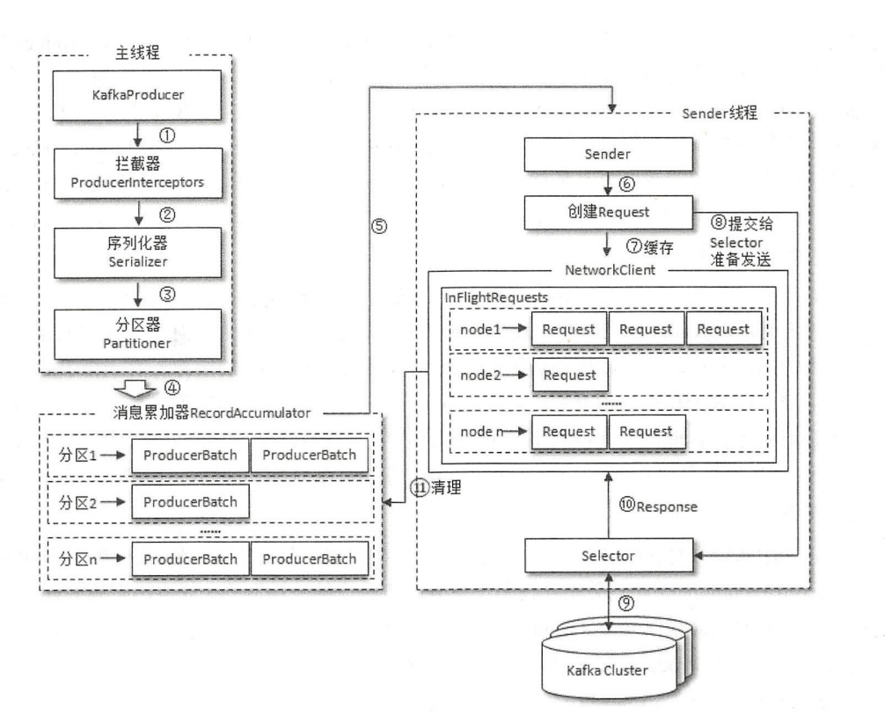
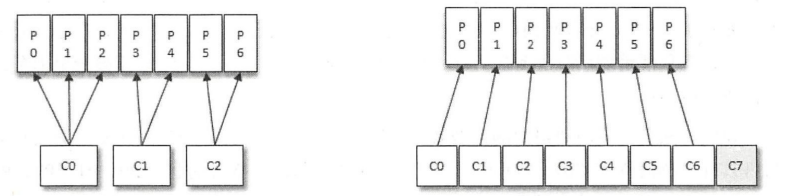
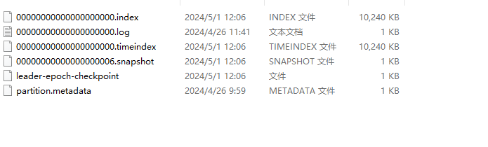
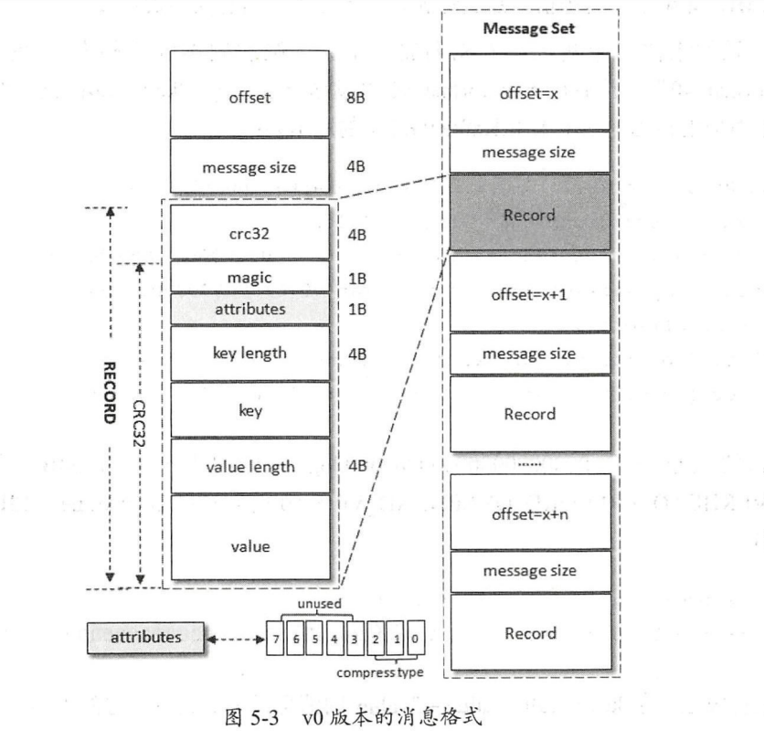
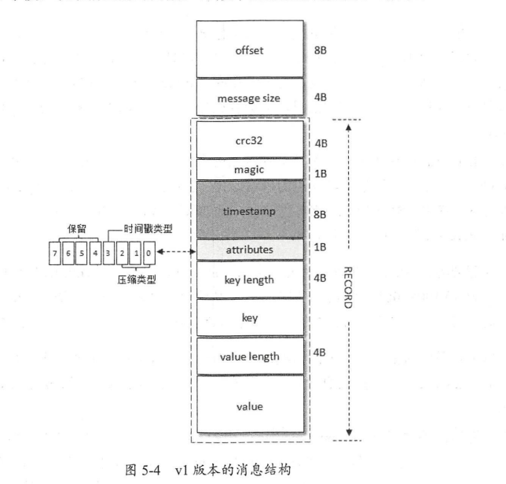
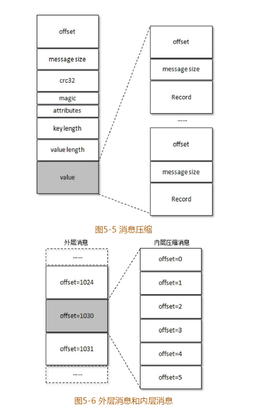

# 笔记-深入理解Kafka：核心设计与实践原理

简单记下笔记

## 第一章 初识Kafka

首先知道他是啥：

* 消息系统： 就是一个消息队列系统, 作用无非就那几个-解耦, 削峰、异步, 然后再加上自己的集群特性, 做到可扩展、可恢复
* 持久化： log文件存消息
* 流式处理平台：提供接口来做窗口、连接、变换和聚合等等的操作

### 1.1 基本概念

> 看下图就好：


* *Producer* : 生产者
* *Broker* : 就是 *Kafka Server*
* *Consumer* : 消费者
* *Message.Topic*: 消息是按Topic去分的
* *Message.Topic.Partition* : *Topic* 划分为不同的分区存储, 分区的数量、分配规则, 能通过配置文件进行配置, 同时还能在运行时, 动态修改创建主题时的分区数量（只能增, 不能减）、分配规则
* *Message.Topic.Partition.Replicas*: 分区时有副本的, 每个分区的副本数量, 分配规则也是跟上面一样, 可以静态设置, 动态修改
* *AR( Assigned Replicas )*, *ISR (In-Sync Replicas)*, *OSR (Out-Sync Replicas)* => *AR* = *ISR* + *OSR*
* "Leader Replicas": 主副本,  负责读写
* "Follower Replica": 从副本, 负责记录猪副本数据, 有一定滞后性
* *Message.Topic.Partition.Replica.LEO*: 该分区下一条消息待写入的 *Offset*
* *Message.Topic.Partition.Replica.HW*: *HW - 1* = 消费者能消费到的最大 *Offset*
* *Message.Topic.Partition.Log* : 在持久化层上可以把分区看成一个追加的 *Log* 文件
* *Message.Topic.Partition.Offset* : 指消息在分区中的一个偏移量, 且是分区中的唯一标识, 也就是 *Kafka* 是分区内有序的

### 1.2 安装和配置

> 3.x 版本安装比较简单, *windows/linux* 版本都是直接下个包, 在本地跑脚本就好了


### 1.3 生产和消费

> 这部分代码在后面的章节是会贴出来了, 这里就不再赘述了

### 1.4 服务端参数配置

> 这里贴出最常见的几个参数说明一下, 配置的内容都是在 *config/server.properties* 里面, 3.x 版本的话, 如果要用 *kraft* 的话, 则看 *config/kraft/server.properties* 文件

* *process.roles* : 进程的角色列表, 逗号分割, 默认：*broker,controller*
* *node.id* : 节点 *id*, 用来标识节点, 在日志可以用来排查问题
* *listeners* : *broker* 监听客户端的协议+地址+端口,格式为 : 协议://地址:端口, 协议值为：*PLAINTEXT, SSL, SASL_SSL*
* *log.dirs* : 持久化目录, *log.dirs* 优先级大于 *log.dir*


## 第二章 生产者


### 2.1 客户端开发

> 这里我先贴整体的代码, 然后再细说

```Java
package org.example.producer;

import org.apache.kafka.clients.producer.KafkaProducer;
import org.apache.kafka.clients.producer.ProducerConfig;
import org.apache.kafka.clients.producer.ProducerRecord;
import org.example.entity.UserProto;

import java.util.Properties;

public class KafkaProducerDemo {

    public static final String BROKER_LIST = "localhost:19092,localhost:29092,localhost:39092";
    public static final String TOPIC = "test";


    public static Properties initConfig() {
        Properties props = new Properties();
        props.put(ProducerConfig.BOOTSTRAP_SERVERS_CONFIG, BROKER_LIST);
        props.put(ProducerConfig.KEY_SERIALIZER_CLASS_CONFIG, "org.apache.kafka.common.serialization.StringSerializer");
        props.put(ProducerConfig.VALUE_SERIALIZER_CLASS_CONFIG, KafkaProducerSerializer.class.getName());
        props.put(ProducerConfig.CLIENT_ID_CONFIG, "producer.client.id.demo");
        props.put(ProducerConfig.RETRIES_CONFIG, 10);
        props.put(ProducerConfig.ACKS_CONFIG, "-1");
        props.put(ProducerConfig.INTERCEPTOR_CLASSES_CONFIG, KafkaProducerInterceptor.class.getName());
        return props;
    }

    public static void main(String[] args) {
        Properties props = initConfig();
        try (KafkaProducer<String, UserProto.User> producer = new KafkaProducer<>(props)) {
            UserProto.User user = UserProto.User.newBuilder().setName("andrew").setSex(1).setCode("c1").build();
            ProducerRecord<String, UserProto.User> record = new ProducerRecord<>(TOPIC, user);
            producer.send(record);
        } catch (Exception e) {
            System.out.println(e.getMessage());
        }

    }
}
```

#### 2.1.1 拦截器

*ProducerInterceptor* 接口是这样的

```java
public interface ProducerInterceptor<K, V> extends Configurable, AutoCloseable {
    ProducerRecord<K, V> onSend(ProducerRecord<K, V> var1);

    void onAcknowledgement(RecordMetadata var1, Exception var2);

    void close();
}
```


> 拦截器的注入方式是这样的, 源码用反射*(getDeclaredConstructor().newInstance())*去实例化对象

```java
props.put(ProducerConfig.INTERCEPTOR_CLASSES_CONFIG, KafkaProducerInterceptor.class.getName());
```

以 kafka-client 3.7.0 为例

*onSend* 方法是在 *KafkaProducer* 源码 357 行执行的

```java
public Future<RecordMetadata> send(ProducerRecord<K, V> record, Callback callback) {
    ProducerRecord<K, V> interceptedRecord = this.interceptors.onSend(record);
    return this.doSend(interceptedRecord, callback);
}
```

*onAcknoledgement* 则是在 703 行触发, 就是在 *onComplete* 的时候调用

```java
public void onCompletion(RecordMetadata metadata, Exception exception) {
    if (metadata == null) {
        metadata = new RecordMetadata(this.topicPartition(), -1L, -1, -1L, -1, -1);
    }

    this.interceptors.onAcknowledgement(metadata, exception);
    if (this.userCallback != null) {
        this.userCallback.onCompletion(metadata, exception);
    }

}
```

#### 2.1.2 序列化器

*StringSerializer* 源码如下

```java
package org.apache.kafka.common.serialization;

import java.io.UnsupportedEncodingException;
import java.nio.charset.StandardCharsets;
import java.util.Map;
import org.apache.kafka.common.errors.SerializationException;

public class StringSerializer implements Serializer<String> {
    private String encoding;

    public StringSerializer() {
        this.encoding = StandardCharsets.UTF_8.name();
    }

    public void configure(Map<String, ?> configs, boolean isKey) {
        String propertyName = isKey ? "key.serializer.encoding" : "value.serializer.encoding";
        Object encodingValue = configs.get(propertyName);
        if (encodingValue == null) {
            encodingValue = configs.get("serializer.encoding");
        }

        if (encodingValue instanceof String) {
            this.encoding = (String)encodingValue;
        }

    }

    public byte[] serialize(String topic, String data) {
        try {
            return data == null ? null : data.getBytes(this.encoding);
        } catch (UnsupportedEncodingException var4) {
            throw new SerializationException("Error when serializing string to byte[] due to unsupported encoding " + this.encoding);
        }
    }
}
```
没啥特别, 就是 *serialize* 里返回了 *string.getBytes()*
自定义的也是一样, 返回 *byte[]* 就好, 反序列化道理一样

> 一般公司都是pb来弄序列化和反序列化的, 以下是我自己的demo代码, 十分简单

```java
package org.example.producer;

import org.apache.kafka.common.serialization.Serializer;
import org.example.entity.UserProto;

public class KafkaProducerSerializer implements Serializer<UserProto.User> {

    @Override
    public byte[] serialize(String s, UserProto.User user) {
        return user.toByteArray();
    }
}
```

#### 2.1.3 分区器

先看看源码定义

```java
package org.apache.kafka.clients.producer;

import java.io.Closeable;
import org.apache.kafka.common.Cluster;
import org.apache.kafka.common.Configurable;

public interface Partitioner extends Configurable, Closeable {
    int partition(String topic, Object key, byte[] keyBytes, Object value, byte[] valueBytes, Cluster cluster);

    void close();

    /** @deprecated */
    @Deprecated
    default void onNewBatch(String topic, Cluster cluster, int prevPartition) {
    }
}
```

默认分区器 *DefaultPartioner* 源码是这样的

```java
public int partition(String topic, Object key, byte[] keyBytes, Object value, byte[] valueBytes, Cluster cluster, int numPartitions) {
    return keyBytes == null ? this.stickyPartitionCache.partition(topic, cluster) : BuiltInPartitioner.partitionForKey(keyBytes, numPartitions);
}
```
主要看key是否为空, 如果空的话调用 *stickyPartitionCache.partition*,  随机一个可用的分区来写入 <p>
非空就用内置分区器, 先用 *Utils.murmur2* 来 *hash*,  最后 % *numPartitions*

#### 2.1.4 消息发送

发送模式有三种: 发后即忘(*fire-and-forget*)、 同步 (*sync*)、 异步(*async*), 其实 *send* 返回的是 *Future* 对象, 所以传参肯定有 *Callback* 的入参, 要同步模式的话, 直接 *Future.get* 即可。
这里讲讲增加可靠性的套路

> 注意： 提高可靠性会导致性能下降

```java
props.put(ProducerConfig.RETRIES_CONFIG, 10); // 增加重试次数
props.put(ProducerConfig.ACKS_CONFIG, -1); //  确保所有副本有响应了才当成功
```


### 2.2 原理分析

#### 2.2.1 整体架构


> 完整的发送流程图如下:




> 整体流程分两个线程完成, 一个主线程, 一个发送线程, 1-5 主线程完成 

1. 主线程通过 *KafkaProducer* 创建消息
2. 看客户端有没有实现 *ProducerIntercepter* 这个接口, 如果有就对消息进行拦截处理, 一般拦截是为了对消息做简单处理, 因为太复杂会影响发送速度, 同时这玩意是可以链式编程的, 里面的 *onSend()* 在发送前触发, *onAcknowleagement()* 在 *Selector* 返回 *Response* 后马上触发？
3. 对消息的 *key*, *value* 进行序列化操作, 要自定义, 就实现 *org.apache.kafka.common.serlization.Seralizer* 接口,  *configure()* 配置当前类, 
*serialize(String topic, T data)* 就是序列化方法, 返回 *byte[]*, *close()* 用来关闭序列化器
4. 知道 *Topic* 了, 就得知道消息往哪个分区发了, 如果没有自定义分区器, 那么就用默认方法来确定发送的分区, 如果有就根据自定义的结果确定分区号
5. 主线程把消息缓存到对应的 *RecordAccumulator* 中,  数据结构是 *Map<Partiion, Deque\<ProducerBatch\>>* , *buffer.memory* 控制大小, 消息太多会阻塞发送方法,  *max.block.ms* 控制阻塞等待时间, *batch.size* 控制 *ProducerBatch* 大小
6. *Sender* 线程创建 *Sender* 对象, 把 *RecordAccumulator*.*Map<Partiion, Deque\<ProducerBatch\>>* 转换成 *Map<Node, List\<ProducerBatch\>>*, 最后封成 *<Node, Request>* 对象
7. *<Node, Request>* 转成 *Map<NodeId, Deque\<Request\>>* 放到 *InFlightRequests* 中, 这玩意是用来记录发了, 但没有响应的 *Request*,  *max.in.flight.requests.per.connection* 默认为5, 表示每个连接最大等待响应的请求数是5, 超过5就不能发送了。还能根据 *Deque<Request>.size()* 来判断每个 *Node* 的负载情况

#### 2.2.2 元数据更新

> 元数据指的是各个节点的基本信息, 包括节点地址、节点主题、节点的分区、分区 *leader/follower* 副本信息, *AR/ISR*, *Controller* 节点

上述的元数据是通过 *Sender* 线程来更新的, 更新步骤如下
1. 找出 *leastLoadedNode* (*count* 一下 *InFlightRequests*.*Deque<Request>.size()*)
2. 发送 *MetadataRequest*, 然后缓存到 *InFlightRequests*


### 2.3 重要的生产者参数

> 这些参数都是在创建 *Producer* 的时候放到 *props* 里面的

* *ack*: <p> 
        = 1 表示 *leader* 副本成功写入, 就会收到来自服务端的写入成功响应, 数据有可能会丢 <p>
        = 0 表示不用等服务端任何响应。速度最快是它了, 但它最容易丢数据 <p>
        =-1 表示所有 *ISR* 成功写入才返回成功, 最大可靠性是它了
* *max.request.size*: 客户端能发送消息的最大值, 默认 1048576*B*=1*M*, 必须 *<= broker*.*message.max.size*
* *retries*: 生产者重试次数
* *retry.backoff.ms* : 重试之间的间隔, 默认 100
* *compression.type*: 消息压缩方式, 默认 *none*, 可以为 *gzip* *snappy* *lz4*
* *connections.max.idle.ms*: 每个限制连接最大存活时间
* *linger.ms*: 发送 *ProducerBacth* 之前等待更多消息的时间, 用来控制吞吐量的
* *recieve.buffer.byte*: 控制 *Socket* 接收缓冲区的大小, 默认值是 32768(*B*)=32*KB*
* *send.buffer.byte*: 控制 *Socket* 发送缓冲区的大小, 默认值是 131072(*B*)=128*KB*

## 第三章 消费者

### 3.1 消费者与消费组

> 看下图就知道大概意思了



消费者与消费组、分区的关系就以下几点：

1. 消费者是以分区为单位进行消费
2. 同一 *Topic* 下的消费组, 里面的消费者会均摊 *Topic* 内的 *partition*, 所以可能会出现 *partition* 不够分的情况
3. 消费组内的消费者, 在消费同一 *topic* 下的消息, 显然只会消费一次, 相当于 *p2p* 模式
4. 如果是不同组的消费者, 就相当于广播模式了


### 3.2 客户端开发

> 老规矩, 先把抄的代码贴出来

```java
package org.example.consumer;

import org.apache.kafka.clients.consumer.ConsumerConfig;
import org.apache.kafka.clients.consumer.ConsumerRecord;
import org.apache.kafka.clients.consumer.ConsumerRecords;
import org.apache.kafka.clients.consumer.KafkaConsumer;
import org.example.entity.UserProto;

import java.time.Duration;
import java.util.HashMap;
import java.util.List;
import java.util.Map;
import java.util.concurrent.atomic.AtomicBoolean;

public class KafkaConsumerDemo {

    public static final String BROKER_LIST = "localhost:19092,localhost:29092,localhost:39092";
    public static final String TOPIC = "test";

    private static final String GROUP_ID = "group.demo";

    public static final AtomicBoolean IS_RUNNING = new AtomicBoolean(true);

    public static Map<String, Object> initConfig() {
        Map<String, Object> props = new HashMap<>();
        props.put(ConsumerConfig.BOOTSTRAP_SERVERS_CONFIG, BROKER_LIST);
        props.put(ConsumerConfig.KEY_DESERIALIZER_CLASS_CONFIG, "org.apache.kafka.common.serialization.StringDeserializer");
        props.put(ConsumerConfig.VALUE_DESERIALIZER_CLASS_CONFIG, KafkaConsumerDeserializer.class.getName());
        props.put(ConsumerConfig.CLIENT_ID_CONFIG, "producer.client.id.demo");
        props.put(ConsumerConfig.GROUP_ID_CONFIG, GROUP_ID);

        //额外功能
        props.put(ConsumerConfig.INTERCEPTOR_CLASSES_CONFIG, KafkaConsumerInterceptor.class.getName());
        return props;
    }

    public static void main(String[] args) {
        try (KafkaConsumer<String, UserProto.User> consumer = new KafkaConsumer<>(initConfig())) {
            consumer.subscribe(List.of(TOPIC));
            while (IS_RUNNING.get()) {
                ConsumerRecords<String, UserProto.User> records = consumer.poll(Duration.ofMillis(1000));
                for (ConsumerRecord<String, UserProto.User> record : records) {
                    System.out.printf(" TOPIC = %s, partition = %s, offset = %s, key = %s, value = %s \n",
                            record.topic(), record.partition(), record.offset(), record.key(), record.value());
                }
            }
        } catch (Exception e) {
            System.out.println(e.getMessage());
        }
    }
}

```

#### 3.2.1 必要的参数配置

> 一般都是那几个了, 有了生产者代码的经验之后, 瞄一下就好了, 还有就是生产上最好用 *ConsumerConfig* 的枚举, 自己写容易出错

* *bootstrap.server*: 连的 *kafka.brokers* 的列表
* *group.id*: 就是消费者组 *id*, 如果是空的,  会提示 *To use the group management or offset commit APIs, you must provide a valid group.id in the consumer configuration.* ( *kafka-client v 3.7.0* )
* *key.deserializer*: *key* 的反序列化器,  跟生产者的 *key.serializer* 反过来就行
* *value.deserializer*: *value* 的反序列化器,  跟生产者的 *value.serializer* 反过来就行

#### 3.2.2 *KafkaConsumer* 初始化源码

> 这部分干货, 原书没有的, 我是在找拦截器触发时机的时候看源码, 觉得挺有意思的, 捞出来给大家分享

*KafkaConsumer* 这个类其实是用了代理模式生成了实际执行的 *KafkaConsumer* 对象

```java
public class KafkaConsumer<K, V> implements Consumer<K, V>{
    KafkaConsumer(ConsumerConfig config, Deserializer<K> keyDeserializer, Deserializer<V> valueDeserializer) {
        this.delegate = CREATOR.create(config, keyDeserializer, valueDeserializer);
    }

    KafkaConsumer(LogContext logContext, Time time, ConsumerConfig config, Deserializer<K> keyDeserializer, Deserializer<V> valueDeserializer, KafkaClient client, SubscriptionState subscriptions, ConsumerMetadata metadata, List<ConsumerPartitionAssignor> assignors) {
        this.delegate = CREATOR.create(logContext, time, config, keyDeserializer, valueDeserializer, client, subscriptions, metadata, assignors);
    }
}
```

> 里面根据 *group.protocol* 生成两种消费者对象, 一个是 *AsyncKafkaConsumer*, 一个是 *legacyKafkaConsumer*

```java
public <K, V> ConsumerDelegate<K, V> create(ConsumerConfig config, Deserializer<K> keyDeserializer, Deserializer<V> valueDeserializer) {
        try {
            GroupProtocol groupProtocol = GroupProtocol.valueOf(config.getString("group.protocol").toUpperCase(Locale.ROOT));
            return (ConsumerDelegate)(groupProtocol == GroupProtocol.CONSUMER ? new AsyncKafkaConsumer(config, keyDeserializer, valueDeserializer) : new LegacyKafkaConsumer(config, keyDeserializer, valueDeserializer));
        } catch (KafkaException var5) {
            throw var5;
        } catch (Throwable var6) {
            throw new KafkaException("Failed to construct Kafka consumer", var6);
        }
    }
```


#### 3.2.4 订阅主题与分区

> 这一个章节主要讲的是 *subsribe()* 和 *assign()* 方法

主题订阅支持的模式:

1. *AUTO_TOPICS*: 全名称匹配, 但是需要传主题数组做为传参, 
2. *AUTO_PATTERN*: 正则匹配模式
3. *USER_ASSIGNED*: 用户分配模式, 分配指定 *topic* 下的 *partition*

主题订阅的时候可以传入再平衡的回调方法


#### 3.2.5 消费者拦截器

> 跟原书顺序不一样, 我是按照代码执行顺序来讲的

>> 拦截器的作用其实跟其他框架都一样, 都是给目标对象一个切面, 在触发某些事件/动作的前后插入一些自定义的方法, 先贴一下 *ConsumerInterceptor* 的接口源码

``` java
public interface ConsumerInterceptor<K, V> extends Configurable, AutoCloseable {
    ConsumerRecords<K, V> onConsume(ConsumerRecords<K, V> var1);

    void onCommit(Map<TopicPartition, OffsetAndMetadata> var1);

    void close();
}
```

> *OnConsume* 方法触发时机在 *AsyncKafkaConsumer.poll()/LegacyKafakConsumer.poll()* 中, 当执行了 *pollForFethces* 之后会返回 *fetch* 接着就执行 *onConsume(fetch.records())*

例子
``` java
package org.example.consumer;

import org.apache.kafka.clients.consumer.ConsumerInterceptor;
import org.apache.kafka.clients.consumer.ConsumerRecord;
import org.apache.kafka.clients.consumer.ConsumerRecords;
import org.apache.kafka.common.TopicPartition;

import java.util.ArrayList;
import java.util.HashMap;
import java.util.List;
import java.util.Map;

public class KafkaConsumerInterceptor implements ConsumerInterceptor<String, String> {

    private static final long EXPIRE_INTERVAL = 10 * 1000;

    @Override
    public ConsumerRecords<String, String> onConsume(ConsumerRecords<String, String> records) {
        long now = System.currentTimeMillis();
        Map<TopicPartition, List<ConsumerRecord<String, String>>> newRecords = new HashMap<>();
        for (TopicPartition tp : records.partitions()) {
            List<ConsumerRecord<String, String>> list = records.records(tp);
            List<ConsumerRecord<String, String>> filter = new ArrayList<>();
            for (ConsumerRecord<String, String> i : list) {
                if(now - i.timestamp() <  EXPIRE_INTERVAL){
                    filter.add(i);
                }
            }
            newRecords.put(tp, filter);
        }
        return new ConsumerRecords<>(newRecords);
    }

    @Override
    public void close() {

    }

    @Override
    public void onCommit(Map map) {

    }

    /**
     * configure不是直接继承自Interceptor的
     *
     * @param map 配置map
     */
    @Override
    public void configure(Map<String, ?> map) {

    }
}
```

#### 3.2.6 反序列化

> 反序列化的话只需要继承 *Deserializer* 的 *deserialize(String topic, byte[] data)* 方法即可
> 一般生产都是用 *ProtocalBuffer* 去做序列化和反序列化的, 最简单的 *demo* 如下

```java
package org.example.consumer;

import com.google.protobuf.InvalidProtocolBufferException;
import org.apache.kafka.common.serialization.Deserializer;
import org.example.entity.UserProto;

public class KafkaConsumerDeserializer implements Deserializer<UserProto.User> {

    @Override
    public UserProto.User deserialize(String topic, byte[] data) {
        try {
            return UserProto.User.parseFrom(data);
        } catch (InvalidProtocolBufferException e) {
            throw new RuntimeException(e);
        }
    }
}
```

#### 3.2.7 消费消息

> 这一节主要讲的是 *poll* 方法

这个 *poll()* 方法是个轮训方法, 传参 *Duration* 是指拉去线程的最大阻塞时间(因为没有消息可能得等嘛) <p>
然后返回的 ConsumerRecords 对象呢是可以迭代的

#### 3.2.8 位移提交

> 这一节主要讲的是各个 *offset* 的区别以及提交 *offset* 的一些技巧

消费者在完成消费之后其实是需要提交 *offset* (告诉 *broker* 消费到哪里了) <p>

*offset* 有三个概念 <p>

*consumed offset* = *last consumed offset* = *position()* =  *commited offset*  - 1 <p>

每次提交的都是下个消费的 *offset* <p>

其实无论怎么提交位移量, 都存在着重复消费和消息丢失的风险 <p>

*commit* 分 *sync* 和 *async*,  *async* 时有个回调方法, 是在 *commit* 完成后触发, 生产一般用于更改缓存/数据库中对应数据状态 <p>

降低上面两个风险的做法就是 <p>

1. 自己手动提交,  enable.auto.commit = false
2. 提交 *offset* 需要有重试机制（可以在 *finally* 块中使用同步提交）, 防止提交失败 （但会有重复消费的风险）
3. 自己做幂等性处理, 即使重复消费也不慌


#### 3.2.9 控制或关闭消费

> 其实就是讲了 *pause()* / *resume()* / *close()* / *wakeup()* 方法
 
1. 因为 *idea* 会提示创建 *KafkaConsumer* 实例建议用 *try(resource)* 创建, 所以可以优雅关闭 *consumer* <p>

2. 因为示例代码中的无限循环的判断条件是 *running.get()*, 所以也可以优雅退出循环

3. *wakeup()* 是通过抛出异常( *WakeupException* )来中断消费的, 所以要注意


#### 3.2.10 指定位移消费

> *auto.offset.reset* 粗粒度控制消费起始位置, *consumer.seek()*

1. *seek()* 方法可以指定从某个主题下的某个分区的 *offfset* 进行消费, 如果找不到位移, 就触发 *auto.offset.reset* 

2. *auto.offset.reset* = *earliest*/*latest*/*none* <p>

*earliest* 从 0 开始消费
*latest* 从分区末尾开始消费
*none* 找不到消费位移的时候就抛异常

3. 可以通过 *beginOffsets()* / *endOffsets()* / *seekToBegin()* / *seekToEnd()* 找到头尾位置进行消费

4. 可通过 *consuemr.offsetForTimess( Map<TopciPartition, Long> )* 查找对应的 *offset*, 然后通过 *seek()* 定位消费

#### 3.2.11 再均衡

> 指的是分区所属权从一个消费者转移到另一个消费者的行为, 其实就是发生在消费者组发生变化的时候（组内成员有增减）, 应该怎么处理


1. 再均衡发生期间, 相关的消费者是无法消费的（即对应消费者组内的消费者不可用）
2. 分区重分配的时候, 当前消费者的状态会丢失, 其实就是*A*消费到一半的时候, 分区又给*B*消费, 如果消费位移没提交, 就可能重复消费
3. 再均衡监听器有两个方法来规避这种问题 <p>
   1) *onPartitionsRevoke(Collcetion<TopciPartition>)* <p>
       
       消费者停止消费后, 重分配之前触发 (这里提交已消费完的 *offset*, 本地保存)
   
   2) *onPartitionsAssigned(partitions)* <p>
    
       重分配之后, 消费者开始消费之前触发 (本地保存的 *offset* 找出来, 再 *seek* )

#### 3.2.12 多线程实现

> *KafkaProducer* 是线程安全的, *KafkaConsumer* 是线程不安全的, 这一节主要讲消费者如何多线程消费

> 注意, 如果生产中对消息的顺序性有要求, 不建议使用多线程消费同一分区的数据, 因为还得自己维护数据的有序性

实现方式分以下几种

1. 线程封闭, 实例化多个 *Consumer* 对象进行消费
2. 多线程消费同一个分区（不推荐）
3. 包装 *ThreadPool* 和 *Consumer*, 把 *poll()* 到的 *Record* 扔到 *ThreadPool* 里面, 就是一个 *Consumer* 拉取某个主题, 多线程消费

第三个方案需要注意的是 *offset* 提交问题, 可以用滑窗/*AQS*去解决这个问题

#### 3.2.13 重要的消费者参数

1. *fetch.min.bytes* = 每次拉取最小数据量, 控制吞吐用的
2. *fetch.max.bytes* = 每次拉取最大数据量, 消息大于该值也不会导致消息不可读
3. *fetch.max.wait.ms* = 每次拉取最大等待时间, 也是控制吞吐, 具体看实际应用场景
4. *max.partition.fetch.bytes* = 每个分区每次返回给 *Consumer* 的最大数据量, 指的是 *fetch.bytes / partition_num*
5. *max.poll.record* = 拉取最大消息数, 默认500条
6. *connections.max.idle.ms* = 多久之后关闭限制连接, 默认 540000 *ms*, 就是 9 *min*
7. *exclude.internal.topics* = 是否屏蔽内部主题, 默认是 *true*, 表示不能用正则去订阅主题, *false* 则相反
8. *receives.buffer.bytes* = 接收缓冲区大小, 默认 65536 *B*, 就是 64 *KB*
9. *send.buffer.size* = 发送缓冲区大小, 默认 131072 *B*, 就是 128 *KB*
10. *request.timeout.ms* = 等待请求响应的最长时间, 默认 30000 *ms*
11. *metadata.max.age.ms* = 等待请求响应的最长时间, 默认 30000 *ms*
12. *reconnect.backoff.ms* = 等待请求响应的最长时间, 默认 30000 *ms*
13. *retry.backo ms* = 等待请求响应的最长时间, 默认 30000 *ms*
14. *isolation.level* = 事务隔离等级, *value = "read_uncommitted/read_commiitted"*, 默认是 *read_uncommitted*, 可以消费到 *HW*

## 第四章 主题与分区

### 4.1 主题的管理

> 主题管理可以用 *kafka-topics.sh(bat)* 来管理, 当然还能用 *KafkaAdminClient* 来实现。

#### 4.1.1 创建主题

1. 如果 *auto.create.otpics.enable* = *true*, 客户端(生产者/消费者)会在没有创建对应主题的下, 根据 *num.partitions* 和 *default.replication.facotr* 来创建主题, 命令如下 <p>

```shell
kafka-topics.sh --zookeeper <String : hosts> -create topic [String: topic] --partitions <分区数量> replication-factor <副本数量> 
```

2. *replica-assignment* 命令, 还能指定副本分配

```shell
## 假如 partition_num = 3, replica_nums = 2,  格式如下,  第一个是 *part1* 所在的 *broker*,  以此类推
--replica-assignment <brokerId1:brokerId2, brokerId2:brokerId3, brokerId3:brokerId1......> 
```

> 分区同一 *part* 必须放在不同 *broker* 中, 否则会报异常

3. *--config* 为指定 *topic* 设置参数

```shell
--config <key=value> --config <key=value>...
```

4. 建完主题后, 它会在 *dir.logs*/*dir.log* 创下对应的主题和分区, 一般命名格式为 *\<topic\>-\<partition\>*

5. *topic* 具有唯一性

6. 获取元数据信息就能知道主题、分区、配置情况, 如果是连了 *zookeeper* 的话, 则可以看节点信息获取这些情况


#### 4.1.2 分区副本的创建

自动创建的原理

1. 轮询 *partition*,  然后每次先随机个 *startIndex*, *nextReplicaShift*
2. *startIndex* 算出第一个副本索引 *firstReplicaIndex*, 然后 brokerIds[index] 就是副本落到的broker了
3. *fristReplicaIndex*, *nextReplicaShift* 作为传参, 又传到函数 *prelicaIndex* 里面, 得到第二个 *index*
4. 循环操作

#### 4.1.3 查看主题

> describe 指令查看主题信息, 可额外增加 *topics-with-overrides*(覆盖默认配置的主题), *under-replicated-partitions*(查找失效副本), *unavailable-partitions*(查找不可用副本)

#### 4.1.4 修改主题

> 基本用 *kafka-configs.sh* 中的 *alert* 方法来修改主题, 不支持减少分区

#### 4.1.5 配置管理

> 基本讲 *kafka-configs.sh* 脚本的用法

*example* : 删除某个 *topic* 下的配置
```shell
kafka-configs.sh --zookeeper <zk地址> --alter --entity-type topics --entity-name topic-config --delete-config
cleanup.policy,max.message.bytes
```

#### 4.1.6 主题端参数

格式: 主题端参数 - 对应 *broker* 的参数 = 释义

cleanup.policy - log.cleanup.policy = 日志压缩策略, 默认 *delete*, 可为 *compact* <p>
compression.type - compression.type = 压缩类型, 默认 *producer*, 保留为生产者使用的原始压缩, 可为 *uncompressed/snappy/gzip/lz4* <p>
delete.retention.ms - log.cleaner.delete.retention.ms = 标记为删除的数据保留的时间, 默认86400000, 就是一天 <p>
file.delete.delay.ms - log.segment.delete.delay.ms = 清理文件前等待的时间, 默认60000, 即1分钟 <p>
flush.message - log.flush.interval.messages = 需要收集多少数据才强制刷盘, 默认由操作系统决定, 不建议更改, 值为 *Long.MAX_VALUE* <p>
flush.ms - log.flush.interval.ms = 需要等待多久才强制落盘, 默认也是操作系统决定 <p>
follower.replication.throttled - follower.replication.throttled = 配置被限制速率的主题所以对应的 *follower* 副本列表 <p>
index.interval.bytes - log.index.interval.bytes = 控制添加索引的频率, 默认 4096, 消息字节数超过这个值就会创建索引 <p>
leader.replication.throttled - leader.replication.throttled = 配置被限制速率的主题所以对应的 *leader* 副本列表
.....

#### 4.1.7 删除主题

*kafka-topics.sh* 脚本操作的话就是这样的

```shell
kafka-topics.sh --zookeeper <zk地址> --delete --topic topic-delete
```

*zkCli.sh* 操作是这样的

```shell

rmr /config/topics/<topic-name>
delete /brokers/topics/<topic-name>
```

#### 4.1.8 *zk* 节点信息速查

*/brokers/topics/<topic-name>* : *brokers* 中的创建的 *topics*
*/config/topics/[topic名]* : 查看指定 *topic* 的设置


### 4.2 初识 *KafkaAdminClient*


#### 4.2.1 Kafka 基本使用

基本功能如下

1. 创建主题: CreateTopicsResult createTopics(Collection<NewTopic> topics)
2. 删除主题: DeleteTopicsResult deleteTopics(Collection<String> topics)
3. 列出所有可用的主题: ListTopicsResult listTopics()
4. 查看主题信息: DescribeConfigsResult describeTopics(Collection<STring> topicNames)
5. 查询配置信息: DescribeConfigsResult describeConfigs(Collection<ConfigResource> resources)
6. 修改配置信息: AlertConfigsResult alterConfigs(Map<ConfigResource, Config> configs)
7. 增加分区: CreatePartitionsResult createPartitions(Map<String, NewPartitions> newPartitions)

> 演示代码如下

```java
package org.example.admin;

import org.apache.kafka.clients.admin.*;
import org.apache.kafka.common.config.ConfigResource;

import java.util.Collection;
import java.util.HashMap;
import java.util.List;
import java.util.Map;

public class MyAdminClient {

    private static final String BROKER_LIST = "localhost:19092";
    private static final String TOPIC = "DELETE_TOPIC";

    private static final String DELETE_TOPIC = "topic-demo";


    public static void main(String[] args) {
        Map<String, Object> map = new HashMap<>();
        map.put(AdminClientConfig.BOOTSTRAP_SERVERS_CONFIG, BROKER_LIST);
        map.put(AdminClientConfig.REQUEST_TIMEOUT_MS_CONFIG, 30000);
        map.put(AdminClientConfig.CLIENT_ID_CONFIG, "admin.client");
        try (AdminClient client = AdminClient.create(map)) {
            createTopic(client);
            listAllTopics(client);
            deleteTopic(client);
            describeConfig(client);
            alterConfig(client);
        } catch (Exception e) {
            System.out.println(e.getMessage());
        }
    }

    private static void listAllTopics(AdminClient client) throws Exception {
        ListTopicsResult result = client.listTopics();
        for (TopicListing tl : result.listings().get()) {
            System.out.println(tl.toString());
        }
    }

    private static void createTopic(AdminClient adminClient) throws Exception {
        adminClient.createTopics(List.of(new NewTopic(TOPIC, 3, (short) 3))).all().get();
    }

    private static void deleteTopic(AdminClient adminClient) throws Exception {
        adminClient.deleteTopics(List.of(DELETE_TOPIC)).all().get();
    }

    private static void describeConfig(AdminClient adminClient) throws Exception {
        ConfigResource resource = new ConfigResource(ConfigResource.Type.TOPIC, TOPIC);
        System.out.println(adminClient.describeConfigs(List.of(resource)).all().get().get(resource));
    }

    private static void alterConfig(AdminClient adminClient) throws Exception {
        ConfigResource resource = new ConfigResource(ConfigResource.Type.TOPIC, TOPIC);
        ConfigEntry entry = new ConfigEntry("cleanup.policy", "compact");
        AlterConfigOp config = new AlterConfigOp(entry, AlterConfigOp.OpType.SET);
        Map<ConfigResource, Collection<AlterConfigOp>> configs = new HashMap<>();
        configs.put(resource, List.of(config));
        System.out.println(adminClient.incrementalAlterConfigs(configs).all().get());
    }

}

```

#### 4.2.2 主题合法性验证

1. 生产环境中的 *auto.create.topics.enable* 一般是 *false*, 所以只能用脚本或者 *KafkaAdmin* 创建主题
2. 校验合法性的关键参数是 *create.topic.policy.class.name*, 默认为 *null*, 然后自己实现 *org.apache.kafka.server.policy.CreateTopicPolicy* 接口就行, 最后在 *config/server.properties* 配好这个配置就行
3. 主题合法性校验一般是校验创建的主题中其他参数如 *partition*/*replicas-num* 等等, 反正这个接口入参是 *metadata* 来的, 拿出来用就得了

### 4.3 分区的管理

#### 4.3.1 优先副本的选举

使用场景: 在 *leader* 挂掉之后, 可能需要执行的操作 <p>

目的: 为了防止 *broker* 集群负载失衡 <p>

具体做法: <p>
1. 利用 *auto.leader.rebalance.enable=true*, *Kafka* 控制器会创建定时器来计算不平衡率, 如果超过 *leader.imbalance.per.broker.percentage*, 就会自动执行有限副本的选举, 执行周期为 *leader.imbalance.checke.ientrval.seconds* (默认300s), 缺点是不可控, 也有可能会有性能问题, 引起客户端阻塞
2. 利用 *kafka-perferred-replica-election.sh* 来手动执行, 如果分区数目多, 性能有影响
3. 利用 *json* 文件来对部分主题下的部分分区执行副本优先选举的操作

#### 4.3.2 分区重分配

使用场景: 新加入的 *broker* 不会分配旧分区, 只能分配新主题的分区, 所以需要重新分配分区副本 <p>

目的: 防止分区失衡 <p>

具体做法:

1. 用 "*kafka-reassign-partition.sh --generate --topics-to-move-json-file 文件名 --broker-list 节点数字*" 这个命令来导出重分配方案, 存成json文件
2. 用 "*kafka-reassign-partition.sh --execute --reassignment-json-file 上面的文件*" 这个命令来执行重分配方案, 上一步到处是方便手动更改

#### 4.3.3 复制限流

发生时机: 分区重分配的时候, 就是副本在节点之间复制的时候 <p>

目的: 降低因重分配时带来的性能削减 <p>

具体做法:

1. 用 *kafka-config.sh* + *follower.replication.throttled.rate* 和 *leader.replication.throttled.rate* 设置, 单位是 *B/s*
2. 用 *in/kafka-reassign-partitions.sh --zookeeper localhost:2181/kafka --verify --reassignment-json-file project.json* 查看进度

#### 4.3.4 修改副本因子

使用场景: 创建主题的时候填错副本因子数/运行后想提高可靠性以及容错性

具体做法:

1. 用 *kafka-reassign-partition.sh --generate --topics-to-move-json-file 文件名 --broker-list 节点数字* 来导出当前分配方案
2. 文本修改, 修改的 *json* 节点是 *replicas*  以及 *log_dirs* 


### 4.4 如何选择合适的分区数

>> 看下面的标题就知道怎么选了

#### 4.4.1 性能测试工具

1. 生产者用 *kafka-producer-perf-test.sh  --topic topic-1 --num-records 1000000 --record-size 1024 --throughput 100 --producer-props bootstrap.servers=localhost:9092 acks=1* 

> *throughput* = 0 不限流, 当前限流 100 *bytes*

2. 消费者用 *kafka-consumer-perf-test.sh --topic topic-1 --messages 1000000 --broker-list localhost:9092*, 方法跟上面一样

#### 4.4.2 分区数越多吞吐量就越高吗

> 明细不是, 会有峰值, 看图好像是 50 个分区的时候性能最佳

#### 4.4.3 分区数的上限

跟文件描述符相关, 再多其实也没用

#### 4.4.4 考量因素

看菜吃饭得了, 分区可以设为节点数的倍数, 分区一来均衡, 二来可靠


## 第5章 日志存储

### 5.1 文件目录布局

> 直接看图就得了, 根目录下的日志文件夹命名规则是 *\<topic\>-\<partition\>*




### 5.2 日志格式的演变

> 朝着内容压缩, 属性扩展的方向演变

#### 5.2.1 v0版本

> 十分基础的设计, 只能说该有的都有了



大概抄一下字段的解释

* *crc32* (4B) : crc32 校验, 校验 *magic - value*
* *magic* (1B) : 消息格式版本号, *v0 = 0*, *v1 = 1*, *v2 = 2*
* *attribute* (1B) : 消息属性, 低3位压缩类型: 0 没有压缩 /1 GZIP /2 SNAPPY /3 LZ4
* *key lenght* (4B) : 消息 *key* 长度, -1 表示没有 *key*
* *key* : 可选字段
* *value length* (4B) : 值长度, -1 表示消息为空, 人称墓碑消息
* *value* : 消息体


#### 5.2.2 v1版本



* *attribute* (1B) : 消息属性, 低3位压缩类型: 0 没有压缩 /1 GZIP /2 SNAPPY /3 LZ4, 第四位 0 表示 *timestamp* 类型为 *CreateTime*, *而1表示timestamp* 类型为 *LogAppendTime*, 其他位保留
* *timestamp* (8B) : 时间戳, 表示哪种时间看上面的属性

#### 5.2.3 消息压缩



* 分两层消息, 叫做外层消息和内层消息
* 外层消息的 *offset* = *absolute offset* = 内层消息的最后一条消息
* 找内层消息的 *absolute offset* 很简单, 就是外层的 *offset* 减内层的 *offset*

> 压缩情况的时间戳含义又有区别, 解析如下

外层消息的timestamp设置为：

* 如果timestamp类型是CreateTime，那么设置的是内层消息中最大的时间戳。

* 如果timestamp类型是LogAppendTime，那么设置的是Kafka服务器当前的时间戳。

内层消息的timestamp设置为：

* 如果外层消息的timestamp类型是CreateTime，那么设置的是生产者创建消息时的时间戳。

* 如果外层消息的timestamp类型是LogAppendTime，那么所有内层消息的时间戳都会被忽略。

#### 5.2.4 变长字段

#### 5.2.5 v2版本

> *Kafka 3.x* 的消息格式只支持这个消息格式, 且这个版本多了 *Varints* 和 *ZigZag* 编码

* Varints 表示方法: 每个字节都有一个位于最高位的msb位（most significant bit），除最后一个字节外，其余msb位都设置为1，最后一个字节的msb位为0, Varints中采用的是小端字节序, 即最小的字节放在最前面

### 5.3 日志索引
### 5.4 日志清理
### 5.5 磁盘存储
### 5.6 总结